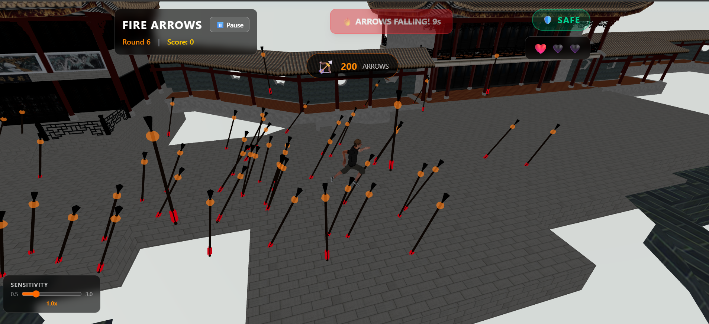

# 🏹🔥 Fire Arrows

A tense, single-player survival game inspired by **Alice in Borderland**. Answer trivia questions - but be careful! The further your answer is from correct, the more deadly fire arrows will rain down from the sky. Find shelter before they hit!



---

## 🎮 How to Play

1. **Answer Questions** - You have 15 seconds to answer a trivia question
2. **Find Cover** - After answering, you have 5 seconds to run under a roof
3. **Survive the Rain** - Arrows fall for 6 seconds. Stay under cover or lose a life!
4. **Repeat** - Survive as many rounds as you can with your 3 lives

### Controls
| Key | Action |
|-----|--------|
| `W` `A` `S` `D` | Move |
| `Mouse` | Rotate camera |
| `ESC` | Pause game |

### Arrow Difficulty
- **Close answer** (< 5% error) → 30 arrows 🎯
- **Okay answer** (< 30% error) → 50-60 arrows 😅
- **Way off** (> 50% error) → 100+ arrows 😱

---

## 🚀 Quick Start

### Prerequisites
- [Node.js](https://nodejs.org/) (v18 or higher)
- npm (comes with Node.js)

### Installation

```bash
# Clone the repository
git clone https://github.com/BhanuPrakash-004/FireArrows.git
cd FireArrows

# Install dependencies
cd frontend
npm install

# Start development server
npm run dev
```

Open [http://localhost:5173](http://localhost:5173) in your browser.

### Build for Production

```bash
npm run build
npm run preview  # Preview the production build
```

---

## 📝 Adding & Removing Questions

Questions are stored in `frontend/src/data/questions.ts`. Each question follows this format:

```typescript
{
  id: 1,                                    // Unique ID
  question: "In what year was X built?",   // The question text
  answer: 1776,                             // Correct numerical answer
  unit: "AD",                               // Optional: unit to display
  hint: "Around the American Revolution"   // Optional: hint for player
}
```

### Adding a New Question

1. Open `frontend/src/data/questions.ts`
2. Add your question to the `questions` array:

```typescript
{
  id: 26,  // Use the next available ID
  question: "How many moons does Jupiter have?",
  answer: 95,
  hint: "It has the most in our solar system"
}
```

3. Save the file - changes take effect immediately in dev mode

### Removing a Question

Simply delete the question object from the array. Make sure to keep the array syntax valid (no trailing commas on the last item).

### Question Guidelines
- **Answers must be numbers** - the game compares numerical values
- Keep questions interesting but answerable
- Hints are optional but help with difficult questions
- The `unit` field displays next to the input (e.g., "meters", "°C", "BCE")

---

## 📁 Project Structure

```
FireArrows/
├── GAME_DESIGN.md          # Game design document
├── README.md               # This file
└── frontend/
    ├── public/
    │   └── models/         # 3D models (.glb files)
    │       ├── ancient_chinese_courtyard_park.glb
    │       └── Running.glb
    └── src/
        ├── App.tsx         # Main game component
        ├── types/game.ts   # TypeScript interfaces
        ├── data/
        │   └── questions.ts    # ⬅️ ADD QUESTIONS HERE
        ├── hooks/
        │   └── useGameState.ts # Game state management
        └── components/
            ├── Player.tsx      # Player movement & controls
            ├── FireArrows.tsx  # Arrow spawning & physics
            ├── EnvironmentMap.tsx
            └── ui/
                ├── StartScreen.tsx
                ├── QuestionModal.tsx
                ├── GameHUD.tsx
                └── GameOverScreen.tsx
```

---

## 🛠️ Tech Stack

- **React 19** + **TypeScript** - UI framework
- **Three.js** + **React Three Fiber** - 3D rendering
- **Rapier** - Physics engine
- **Tailwind CSS** - Styling
- **Vite** - Build tool

---

## 🎯 Game Features

- ✅ 3D environment with roofs for cover
- ✅ Animated player character
- ✅ 25 trivia questions (easily expandable)
- ✅ Dynamic arrow count based on answer accuracy
- ✅ 3-life health system
- ✅ Pause functionality
- ✅ Score tracking
- ✅ Realistic arrow visuals with fire effects
- ✅ Dynamic sky (darkens during arrow rain)

---

## 📜 License

MIT License - feel free to use and modify!

---

## 🙏 Credits

- Inspired by **Alice in Borderland** (Netflix)
- 3D Models from various open-source libraries
- Built with ❤️ and fire arrows
